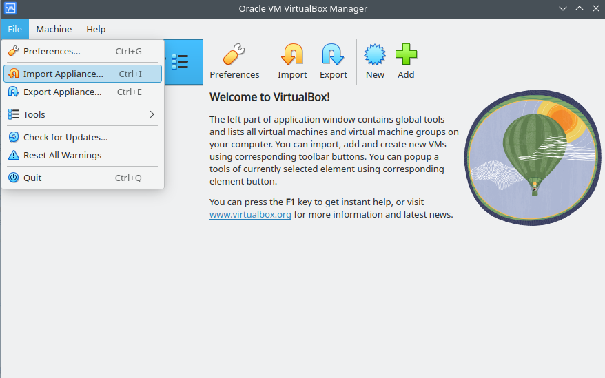
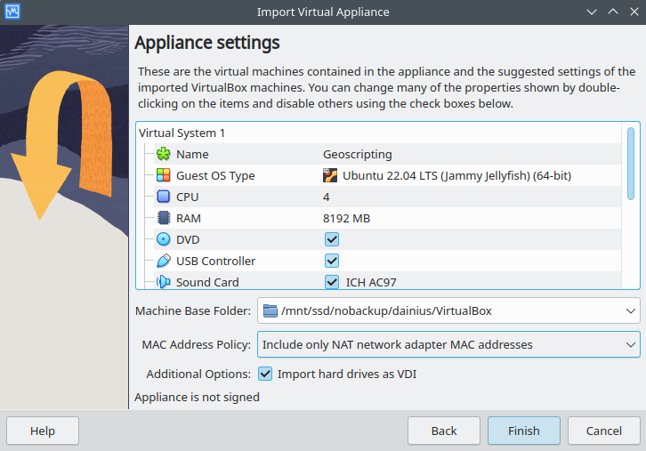
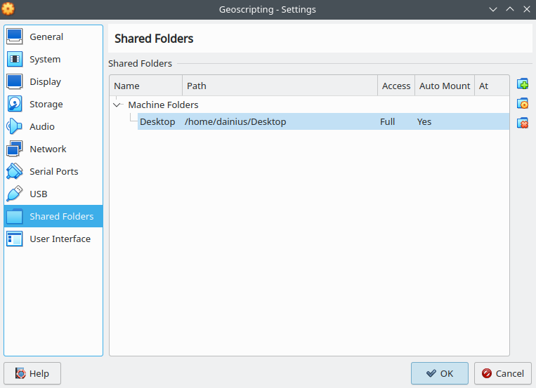

```{css, echo=FALSE}
@import url("https://netdna.bootstrapcdn.com/bootswatch/3.0.0/simplex/bootstrap.min.css");
.main-container {max-width: none;}
pre {color: inherit; background-color: inherit;}
code[class^="sourceCode"]::before {
  content: attr(class);
  display: block;
  text-align: right;
  font-size: 70%;
}
code[class^="sourceCode r"]::before { content: "R Source";}
code[class^="sourceCode python"]::before { content: "Python Source"; }
code[class^="sourceCode bash"]::before { content: "Bash Source"; }
```

<font size="6">[WUR Geoscripting](https://geoscripting-wur.github.io/)</font> 

# Introduction

This page details the easiest ways to set up all the necessary software for taking the Geoscripting course.

Having your system properly set-up is a crucial step before starting any geo-processing with R and Python. The figure below provides an overview of some of the different components of the system and how they are connected with each other.

<center></center>

The easiest way to get it all running is to work via a Linux environment. There, all (or almost all) the tools are already preinstalled for you. However, getting it to run takes a bit of practice. There are a few options:

* Running Linux from a virtual machine inside Windows/macOS - easiest but slowest performance, best if you have a powerful laptop
* Running Linux off of a USB drive (Live system) - best support and ease-of-setup ratio, but requires a spare USB drive
* Installing Linux on a hard drive (external or internal) - best for long-term Linux use, but may destroy your data if you are not careful

In this course, we will use the [Ubuntu 22.04 Jammy Jellyfish](http://releases.ubuntu.com/22.04/) Linux distribution. It is perhaps the most popular general-purpose distribution at the moment. General-purpose means that it does not have any of the geoscripting tools installed out of the box. We have prepared an [install script](https://github.com/GeoScripting-WUR/InstallLinuxScript) that installs all the missing tools, and have created a VirtualBox image with all the tools preinstalled for you. Using VirtualBox with the image we provide is the best way of running all the needed software, and it is also the environment in which we will test all the submissions, including the exam.

If you are taking the course externally and want to follow just one or two lessons, you can often successfully install the needed software also on Windows and macOS. However, it is more difficult to set it up and thus we do not provide support for such installations: you are on your own for that.

```{block type="alert alert-danger"}
**Warning for students taking the course**: during the course we will **not** support non-standard software stacks, because software setup is a time-consuming, difficult to debug process, and different software versions/platforms often cause unexpected bugs. Thus please **use the provided VirtualBox image** introduced below, or if that is not possible for your hardware, one of the options described after that.
```

# Running Linux

## Linux on a VirtualBox virtual machine

We will work with a VirtualBox image.
Note that for this option, you need to have at least 50 GiB (ideally 200 GiB) free space available on your laptop, and for good performance, it should be an SSD drive.

The first step is to [download and install VirtualBox on your computer](https://www.virtualbox.org/).
Note that you need to [make sure that your computer has virtualisation technology (VT-d and VT-x) support enabled in its firmware](https://helpdeskgeek.com/how-to/how-to-enable-virtualization-in-bios-for-intel-and-amd/).
Unfortunately, the instructions for doing do depend on the model of your laptop, so you need to find out how to do that on your own.
If you don't manage, you can go to the [Servicepoint IT](https://www.wur.nl/en/article/laptop-software-service.htm) (see under the heading "Who can help me if I have issues with my laptop?") and ask the staff there to help you set up VirtualBox on your computer.



Once you have VirtualBox installed and virtualisation enabled, you can import the image that we have prepared for you.
First, [download the Geoscripting image by following this link](https://filesender.surf.nl/?s=download&token=733b0d2a-6290-49af-90a0-55b34d2adb29).
Next, click *File → Import Appliance...*, and select the file you just downloaded.
Click *Next* and in *Machine Base Folder* field, select the directory in which you want the image to be placed (this should be on a drive that has at least 50 GiB space).
Next, click *Finish* and wait for the import to finish.



Once it is finished, you will see a new virtual machine called Geoscripting in the main window of VirtualBox.
Click *Machine → Settings...* and make sure there are no errors or warnings that are pointed out at the bottom of the window.
Next, go to the *System* tab and set the number of cores and the amount of memory you want to give to the virtual machine.
It should be as much as possible, while leaving enough for your host OS to run.
The green line is a good indicator, you can set the sliders to the maximum that is still within the green line.
Do the same in the *Display* tab for the video memory.
In the *Shared Folders* tab, you can add a folder on your computer that will become available as a directory in the Linux image, so that you can copy files from/to your host OS.



Lastly, click *OK* to dismiss the configuration window, and click the big green *Start* arrow.
If all went well, after some time you will see a login screen.
The password is the same as the username, that is, `osboxes.org`.
This is also the administrator password.

# Alternative options

If you can't get a VirtualBox image running due to hardware limitations, below are two methods of running it from a hard disk directly.
Note that you can also request a fallback virtual machine on the cloud (SURF Research Cloud or VMWare Horizon); consult the staff for guidance on what is the best option in your case.

## Linux on a USB drive

Download the ISO image of [Ubuntu 22.04](http://releases.ubuntu.com/22.04/), and write it onto a USB stick. There are several programs to do so depending on your operating system, e.g. [Rufus](https://tutorials.ubuntu.com/tutorial/tutorial-create-a-usb-stick-on-windows) on Windows.

This will create a *non-persistent* Live USB. That means that any changes you do will be lost on reboot. If you want to keep your changes, you have two options: 1) Write a persistent Live USB *from within Linux*, or 2) *install* Linux on external/internal hard drive.

### Persistent Live USB

To make a persistent Live USB, you need to: 1) have a large enough USB drive (8 GiB minimum, 16 GiB recommended), 2) be booted into Linux. This is a bit of a chicken-and-egg problem (only Linux can read and write Linux file systems, and a Linux file system is required to create a persistence file larger than 4 GiB). This point can be solved by either using an existing Linux PC, or by using two USB sticks. An example of the latter follows.

In addition, you need to have the ISO image of the OS you want to install. You can either use a yet another USB stick that holds this ISO, or download the ISO from the web once booted into Linux (provided you have enough RAM to hold it). It's also possible to access an ISO file that you downloaded on Windows, but that requires Windows to be properly shut down (i.e. disable hibernation before shutting down) before booting Linux, or else Linux will refuse to open a Windows file system so as not to damage it.

On a small USB stick (this can be ~4 GiB), create a non-persistent Live USB by following the directions above. Boot into it, connect the large USB stick, open the terminal, and install and run the USB creation tool by running the commands:

```{bash, eval=FALSE}
sudo add-apt-repository universe
sudo add-apt-repository ppa:mkusb/ppa
sudo apt update
sudo apt install mkusb usb-pack-efi
sudo -H mkusb /path/to/iso/filename.iso
```

When the `mkusb` program is launched, choose `d` (dus option). Then option `p` "Persistent live", `upefi`, select the target device, choose the amount of space (100% is fine), select `Go`. If the terminal says `Done :-)`, then it's finished. If it gives an error, it might still have succeeded, as some errors are non-critical.

```{block type="alert alert-danger"}
**Danger**: when you are asked to select the target device, be *very careful* not to wipe your small USB or an internal disk! Make sure that the size matches the size of your large USB drive.
```

Reboot, take out the small USB stick, boot from the large one, and you should be good to go. Any changes you make will be stored and persist between reboots.

## Linux on a hard drive

The methods described above make a *Live system*, that is, the contents of the USB drive are mostly stored in memory, which is fast but limits the amount of memory you can use for data processing. You can also *install* Linux, to make it a regular operating system. It can be installed on an internal hard drive, or even an *external* hard drive or a large, fast USB stick. In case of an external drive, you get a portable system that you can boot from any PC, but it may be slower than when using a persistent Live USB. If installed on an internal hard drive, it can live alongside another OS like Windows in a *dual boot* setup.

To install Linux onto a hard drive, boot from a Live USB (as detailed above) and double-click on the "Install" icon on the desktop, and follow the setup wizard.

```{block type="alert alert-danger"}
**Danger**: again, be *very careful* in the partitioning step! If you damage a partition that stores valuable data or another operating system, it will be *permanently lost*!
```

```{block type="alert alert-info"}
**Pro-tip**: See the [installing Linux on your own hardware](../Intro2Linux/installation.html) page for more details.
```

## Installing necessary software

Now that you are running Linux, you should run the install script that fetches all the needed software for you. For that, open the terminal and run the following commands:

```{bash, eval=FALSE}
sudo apt update
sudo apt install git
git clone https://github.com/GeoScripting-WUR/InstallLinuxScript.git
cd InstallLinuxScript
cd focal        ## In case you're running Ubuntu 20.04
cd osgeo-bionic ## In case you're running OSGeo Live 13
bash install.sh
```
