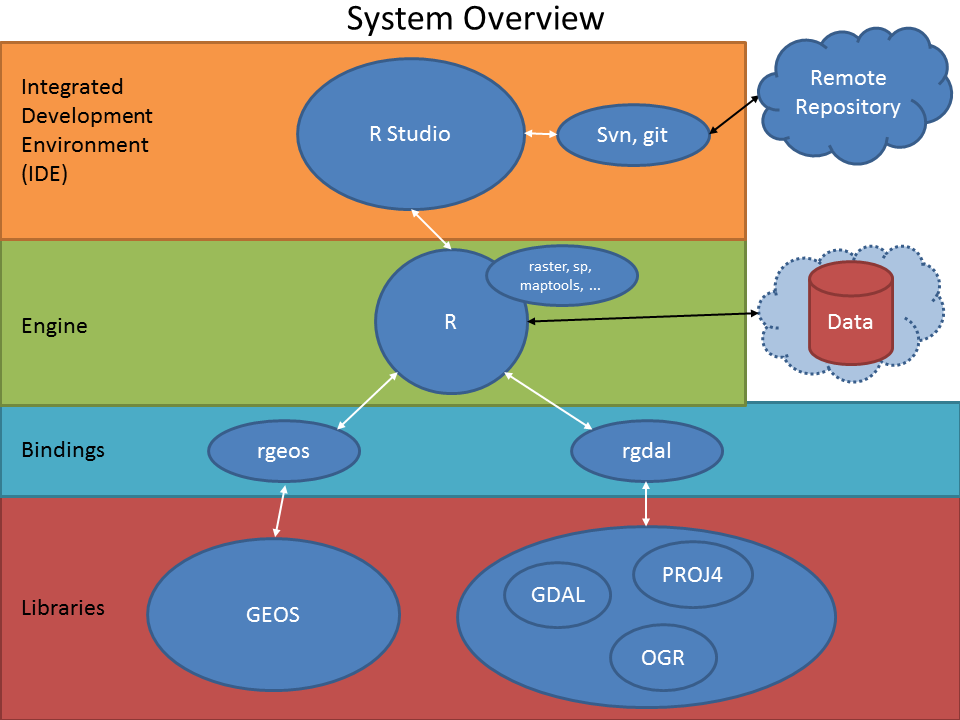

# Introduction

Having your system properly set-up is a cricial step before starting any geo-processing with R and Python. This short tutorial will guide you through some important steps that you should follw in order to have the required software installed and appropriately set-up. The figure below provides an overview of the different components of the system and how they are connected with each others.

<center></center>

For the geo-scripting course (2017) we recommend you to work via a Linux environment as there all open-source tools, scripting languages (Python!) and their packages can be installed more easily. As such, in the PC labs we will work via SURFsara HPC Cloud, from which you are able to start up an Ubuntu Linux environment and connect to it remotely. It is also possible to connect to it from any other computer running the *X2go* software. See lesson 2 for more details.

In case you just want to use R, you can continue and still choose to work on Windows (see below). 
For Python programming we will work within a Linux environment.

# On Windows

## Linux on Windows

There are several other methods to have Linux running on a Windows machine. You can use virtualisation software, such as [VirtualBox](https://www.virtualbox.org/) or [VMWare Player](http://www.vmware.com/go/tryplayer), to install a Linux distribution into a virtual machine (VM). This method is convienient if you need to run both Windows and Linux programs at the same time, but the computer resources are then shared between the two operating systems.

Another method is to write a Linux distribution onto a USB stick, then reboot into it. That allows the Linux distribution to make use of all your computer resources. But changes made in a live environment are limited: only some files are saved, so packages that are installed disappear after a reboot. If you have an external hard drive, Linux can also be installed on it, allowing to save all changes.

The last method is to install Linux alongside Windows in a dual-boot combination. However, this change is permanent and should be done with caution.

In all cases, the [OSGeo Live](http://live.osgeo.org/en/index.html) distribution is recommended for GIS work. For permanent installations, a more general-purpose distribution (Ubuntu, openSUSE, Mageia etc.) is recommended instead.

## Installing software on Windows directly (only recommended for R scripting)

### R and R Studio 
For information on how to install R and R Studio, please refer to the [R installation manual for windows](http://cran.r-project.org/doc/manuals/r-devel/R-admin.html#Installing-R-under-Windows) and the [R Studio download page](http://www.rstudio.com/ide/download/).

### Rtools
Rtools is essential if you want to build R package. It is relatively easy to install, simply download the binary associated with your R version from [this page](http://cran.r-project.org/bin/windows/Rtools/), and follow the instructions from the installer. When prompted for ''Edit the system path'', you must say yes.

### GDAL/OGR/PROJ4 libraries
Installing these libraries on Windows is not an absolute necessity, however they will come in handy if reprojecting data represent a large part of your work or if you plan on doing a lot of file format conversions. They are an absolute necessity if you have to work with hdf4 format data.
Many options are available for installing these libraries on Windows systems.

* FWTools.
* Installation via OSGeo4W installer.
* By installing Quantum GIS.

The two latter option should be prefered over FWTools since they contain the most up to date versions of gdal.
Note that if you want to call some gdal utilities (i.e.: `gdalwarp`, `gdal\_translate`, `gdal\_merge.py`, etc) via `system()` command from R, you will need to append the bin directory containing gdal utilities to your user or system path.

### Version control software
Installing these software is not an absolute necessity, however it might come handy if you plan to implement some of the good practices discussed in Lesson 2. Refer to Lesson 2 for more details.

### Git and SlickSVN
Most likely you need one OR the other, depending on whether your repository is hosted on a git or Subversion version control system. Only git is required if you plan to follow the full tutorial of Lesson 2.
These software are very straightforward to install, simply download the executables and follow the instructions from the installer. [Git](http://git-scm.com/downloads) download page, and [slickSVN](http://www.sliksvn.com/en/download) download page.


### Integration with the R Studio IDE
It is possible that R Studio automatically detects Git and SlickSVN on your system, however this is not systematic. In case the Git/Svn buttons in R Studio are innactive (for instance under project - Create Project - Version Control), after installing either Git or SlickSVN, follow the steps described bellow.
Once SlickSVN (or git) has been installed, in order to allow it to interact with RStudio, its path has to be set. Conveniently that can be done directly from within RStudio. In R Studio, navigate to Tools - Options - Git/SVN - SVN (or Git) - Browse and select the SVN.exe (or git.exe) executable in C:/Program Files/SlikSVN/bin/ (or C:/Program Files/git/bin/)
Restart RStudio.

## Specific R packages
Not all packages are hosted on the CRAN package repository, this is the case for instance of the MODIS package that is maintained on R Forge, and requires an extra argument in the `install.packages()` function to be installed. The install line, to be copy pasted in the R shell is often given on the package R forge home page.

# Linux

See for more info also http://live.osgeo.org/en/index.html. Generally setup instructions are dependent on the Linux distribution, and almost always involves getting packages from the distribution's package manager.

## Debian/Ubuntu

### R

R can be installed directly from the base repository.

```bash
sudo apt-get install r-base r-base-dev
```

For newer R versions and packages, see instructions [here](http://cran.r-project.org/bin/linux/ubuntu/README).

### R GUIs

There are a variety of R GUIs available. Some of them, like RKWard, are packaged in the base repository:

```bash
sudo apt-get install rkward
```

RStudio is not currently packaged in the base repositories or any PPAs, but manual installation instructions can be found [here](http://www.rstudio.com/ide/download/desktop).

### GDAL/OGR/PROJ4/GEOS libraries

The easiest solution is probably to install these libraries directly from an apt repository. Recent versions of these libraries are maintained on the Ubuntu GIS ppa.

```bash
sudo add-apt-repository ppa:ubuntugis/ppa
sudo apt-get update
```


Then install the libraries with apt-get.
```bash
sudo apt-get install gdal
sudo apt-get install proj
sudo apt-get install geos
```

Your system should be ready to install rgdal and rgeos R packages.

## openSUSE

### R

R can also be installed from the base repository:

```bash
sudo zypper install R-base R-base-devel
```

Newer versions are available from the [devel:languages:R:released OBS repository](https://build.opensuse.org/package/show?project=devel%3Alanguages%3AR%3Areleased&package=R-base).

### R GUIs

Some R GUIs, such as RKWard, are available in the base repository:

```bash
sudo zypper install rkward
```

RStudio is packaged as part of the [devel:languages:R:released](https://build.opensuse.org/package/show?project=devel%3Alanguages%3AR%3Areleased&package=rstudio) repository, like R base.

### GDAL/OGR/PROJ4/GEOS libraries

These libraries are provided by the [Applications:Geo](https://build.opensuse.org/project/show/Application:Geo) OBS repository.


# Mac

Similarly as on windows we recommend to work via *VMware Player*. However, *VMware Player* is not free!!! It that is a problem, let us know that we recommend working via an USB3.0 stick and use a bootable OSGEOLIVE linux version (http://live.osgeo.org/)

## Installing software directly on Mac

### R and R Studio

Download and install the latest R version available from: [http://cran.r-project.org/bin/macosx/]. Download and install the latest Rstudio Desktop from the [R Studio download page](http://www.rstudio.com/ide/download/).


### GDAL/OGR/PROJ4 libraries
Installing these libraries on Mac is not required for the Geo-scripting course as the *rgdal* and *rgeos* R package contain the GDAL C++ library. However, they will come in handy if reprojecting data represent a large part of your work or if you plan on doing a lot of file format conversions. They are an absolute necessity if you have to work with hdf4 format data.

The best option for install RGDAL on mac is via the [Kynchaos website](http://www.kyngchaos.com/software/frameworks). At the time of writing this description install the \textbf{GDAL 1.10 Complete} set if you the GDAL library (not required for the course).  Check out a [tutorial](http://spatial.ly/2010/11/installing-rgdal-on-mac-os-x/) if you need more info.

### Version control software
Installing these software is not an absolute necessity, however it might come handy if you plan to implement some of the good practices discussed in Lesson 2. Refer to Lesson 2 for more details.

Most likely you need one OR the other, depending on whether your repository is hosted on a git or Subversion version control system. Only git is required if you plan to follow the full tutorial of Lesson 2. See here for an excellent and clear description for how [to install SVN and Git on Mac so that you can use it within RStudio](http://www.rstudio.com/ide/docs/version_control/overview). RStudio IDE should automatically be able to find SVN and Git.

See here for more info if needed: (1) [extra info for OSX](http://superuser.com/questions/455214/where-is-svn-on-os-x-mountain-lion). Git should be available to via Xcode, or (2) [this question](http://apple.stackexchange.com/questions/18470/why-is-git-not-found-after-installing-os-x-lion) helps.

### Specific R packages
Not all packages are hosted on the CRAN package repository, this is the case for instance of the MODIS package that is maintained on R Forge, and requires an extra argument in the `install.packages()` function to be installed. The install line, to be copy pasted in the R shell is often given on the package R forge home page.

### Extra help

Other links where you can find help:


* [Problem when install in Git on Mac Lion os x 10.8](http://stackoverflow.com/questions/12994351/git-installation-issue-in-mountain-lion-os-x-10-8)

